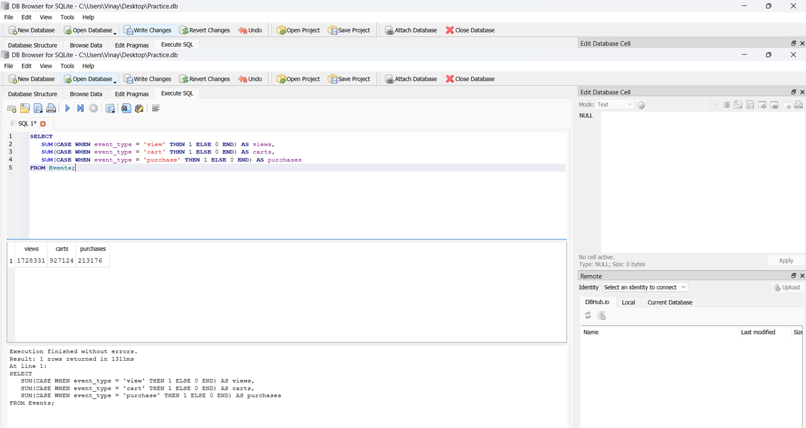

# Product-analytics-funnel-system
Product analytics project analyzing user behavior across an e-commerce funnel using SQL and Power BI. Includes funnel conversion analysis, DAU metrics, and product performance insights.

### Event Distribution Analysis

This query analyzes the distribution of user interaction events in the e-commerce platform.

Results show that:

- Most interactions are product views
- A significant drop occurs between cart and purchase
- High remove_from_cart events suggest potential friction during checkout

This insight helps product teams identify where users drop off in the purchasing journey.

### Event Distribution

This query analyzes how users interact with the e-commerce platform.
SELECT event_type, COUNT(*) AS count_of_events
FROM Events
GROUP BY event_type
ORDER BY count_of_events DESC;

Result:

## Funnel Metrics

This query calculates the number of product views, cart additions, and completed purchases.

The funnel helps identify how users move through the e-commerce purchase journey.

SQL Query:
SELECT
   SUM(CASE WHEN event_type = 'view' THEN 1 ELSE 0 END) AS views,
   SUM(CASE WHEN event_type = 'cart' THEN 1 ELSE 0 END) AS carts,
   SUM(CASE WHEN event_type = 'purchase' THEN 1 ELSE 0 END) AS purchases
FROM Events;

Result:

