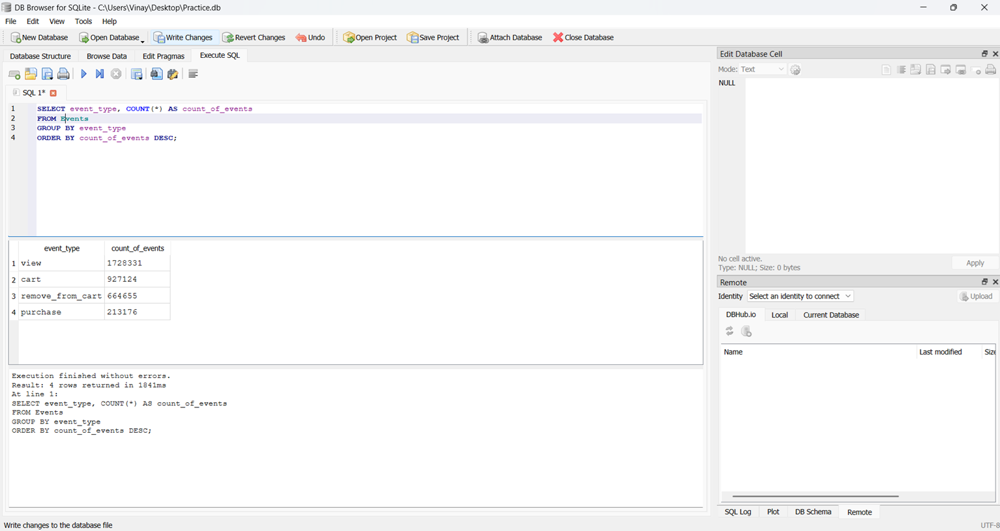

# Product-analytics-funnel-system
Product analytics project analyzing user behavior across an e-commerce funnel using SQL and Power BI. Includes funnel conversion analysis, DAU metrics, and product performance insights.

### Event Distribution Analysis

This query analyzes the distribution of user interaction events in the e-commerce platform.

Results show that:

- Most interactions are product views
- A significant drop occurs between cart and purchase
- High remove_from_cart events suggest potential friction during checkout

This insight helps product teams identify where users drop off in the purchasing journey.

### Event Distribution

This query analyzes how users interact with the e-commerce platform.

Result:

