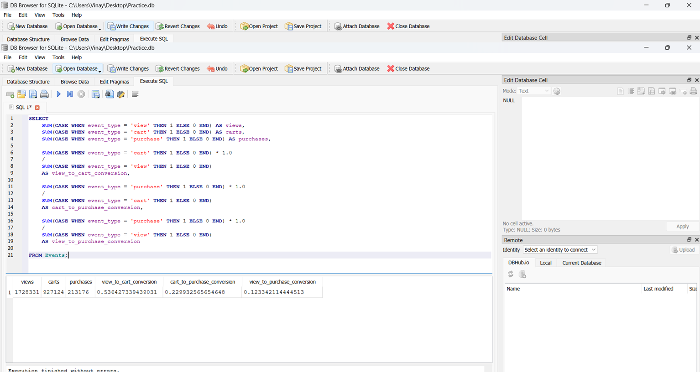

# Product-analytics-funnel-system
Product analytics project analyzing user behavior across an e-commerce funnel using SQL and Power BI. Includes funnel conversion analysis, DAU metrics, and product performance insights.

### Event Distribution Analysis

This query analyzes the distribution of user interaction events in the e-commerce platform.

Results show that:

- Most interactions are product views
- A significant drop occurs between cart and purchase
- High remove_from_cart events suggest potential friction during checkout

This insight helps product teams identify where users drop off in the purchasing journey.

### Event Distribution

This query analyzes how users interact with the e-commerce platform.
SELECT event_type, COUNT(*) AS count_of_events
FROM Events
GROUP BY event_type
ORDER BY count_of_events DESC;

Result:

## Funnel Metrics

This query calculates the number of product views, cart additions, and completed purchases.

The funnel helps identify how users move through the e-commerce purchase journey.

SQL Query:
SELECT
   SUM(CASE WHEN event_type = 'view' THEN 1 ELSE 0 END) AS views,
   SUM(CASE WHEN event_type = 'cart' THEN 1 ELSE 0 END) AS carts,
   SUM(CASE WHEN event_type = 'purchase' THEN 1 ELSE 0 END) AS purchases
FROM Events;

Result:

## Conversion Rates

This query calculates key conversion metrics in the e-commerce purchase funnel.
It aggregates user interaction events from the Events table and measures how users move through the stages of the purchase journey.
The funnel consists of three main stages:

Product View → Add to Cart → Purchase
Metrics Calculated

Views
Total number of product view events.

Carts
Total number of times users added products to their carts.

Purchases
Total number of completed purchase events.

View to Cart Conversion Rate
Percentage of product views that resulted in a cart addition.

carts / views

This indicates how effectively product pages encourage users to add items to their carts.

Cart to Purchase Conversion Rate
Percentage of carts that resulted in a completed purchase.

purchases/carts

This metric helps identify checkout friction and cart abandonment issues.

View to Purchase Conversion Rate
Percentage of product views that ultimately lead to a purchase.

purchases/views

This represents the overall effectiveness of the e-commerce funnel.

Business Insight

From the dataset analysis:

A large number of users view products.

Approximately 53% of views lead to cart additions, indicating strong product engagement.

However, only about 23% of carts convert to purchases, suggesting potential cart abandonment during checkout.

These insights help product teams identify opportunities to improve the checkout experience and increase conversion rates.

SQL Query
SELECT
    SUM(CASE WHEN event_type = 'view' THEN 1 ELSE 0 END) AS views,
    SUM(CASE WHEN event_type = 'cart' THEN 1 ELSE 0 END) AS carts,
    SUM(CASE WHEN event_type = 'purchase' THEN 1 ELSE 0 END) AS purchases,

    SUM(CASE WHEN event_type = 'cart' THEN 1 ELSE 0 END) * 1.0
    /
    SUM(CASE WHEN event_type = 'view' THEN 1 ELSE 0 END)
    AS view_to_cart_conversion,

    SUM(CASE WHEN event_type = 'purchase' THEN 1 ELSE 0 END) * 1.0
    /
    SUM(CASE WHEN event_type = 'cart' THEN 1 ELSE 0 END)
    AS cart_to_purchase_conversion,

    SUM(CASE WHEN event_type = 'purchase' THEN 1 ELSE 0 END) * 1.0
    /
    SUM(CASE WHEN event_type = 'view' THEN 1 ELSE 0 END)
    AS view_to_purchase_conversion

FROM Events;

Result 

## Daily Funnel Analysis

This query analyzes user conversion trends over time by calculating daily unique users who viewed products and completed purchases.

Insights:

Conversion rates vary across days, indicating user behavior changes over time

Helps identify high-performing vs low-performing days

Useful for tracking the impact of product or marketing changes.

SQL Query

SELECT 
    DATE(event_time) AS event_date,

    COUNT(DISTINCT CASE WHEN event_type = 'view' THEN user_id END) AS viewed,

    COUNT(DISTINCT CASE WHEN event_type = 'purchase' THEN user_id END) AS purchased,

    COUNT(DISTINCT CASE WHEN event_type = 'purchase' THEN user_id END) * 1.0 /
    NULLIF(COUNT(DISTINCT CASE WHEN event_type = 'view' THEN user_id END), 0) AS conversion

FROM Events

GROUP BY DATE(event_time)

ORDER BY event_date;

Result:

## Category Segmentation Analysis

This query analyzes user conversion performance across different product categories.

Business Objective:
Identify which categories perform well in converting users from viewing to purchasing.

Key Metrics:

Users Viewed

Users Purchased

Conversion Rate

Insights:

Highlights high-performing categories with strong conversion

Identifies categories with high interest but low purchase completion

Helps prioritize product and UX improvements

Query:

SELECT 
    category_code,

    COUNT(DISTINCT CASE WHEN event_type = 'view' THEN user_id END) AS users_viewed,

    COUNT(DISTINCT CASE WHEN event_type = 'purchase' THEN user_id END) AS users_purchased,

    COUNT(DISTINCT CASE WHEN event_type = 'purchase' THEN user_id END) * 1.0 /
    NULLIF(COUNT(DISTINCT CASE WHEN event_type = 'view' THEN user_id END), 0) AS conversion

FROM Events

GROUP BY category_code

ORDER BY conversion DESC;

Result: 

